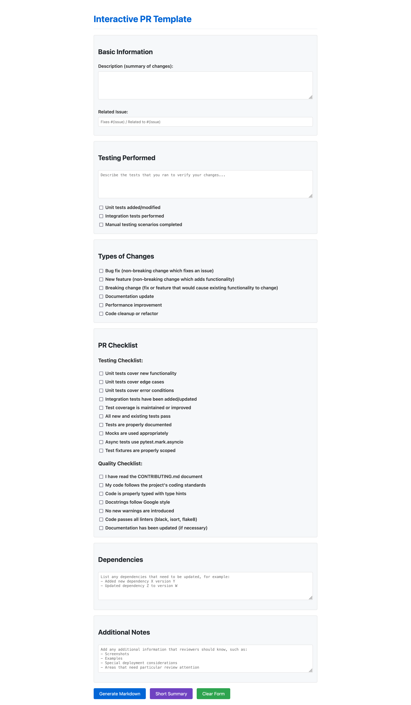

# Interactive PR Template

A user-friendly web tool that helps developers create well-structured, consistent pull request descriptions with minimal effort.



## Overview

The Interactive PR Template provides a simple form interface that guides developers through creating comprehensive PR descriptions. It ensures that all important aspects of a PR are documented, improving team collaboration and code review quality.

## Usage

1. Visit [https://interactive-pr-template.vercel.app](https://interactive-pr-template.vercel.app)
2. Fill out the form with your PR details
3. Click "Generate Markdown" for a complete template or "Short Summary" for a concise version
4. Copy the generated output using the "Copy to Clipboard" button
5. Paste the content into your GitHub PR description

## Features

- **User-friendly form interface** - Easy to use with clear sections and checkboxes
- **Two output formats**:
  - Full markdown PR template with all details
  - Concise summary for smaller changes
- **Comprehensive sections**:
  - Basic information (description, related issues)
  - Testing details
  - Change type classification
  - Quality and testing checklists
  - Dependencies
  - Additional notes
- **One-click copying** to clipboard
- **Lightweight** - No external dependencies, works offline
- **Customizable** - Easy to modify for project-specific requirements

## Local Development

To run this project locally:

```bash
# Clone the repository
git clone https://github.com/yourusername/interactive-pr-template.git

# Navigate to the project directory
cd interactive-pr-template

# Open the HTML file in your browser
open interactive-pr-template.html
```

No build process or server required - simply open the HTML file in any modern browser.

## Customization

The template can be easily customized for team-specific needs:

1. Open `interactive-pr-template.html` in any text editor
2. Modify the form fields, checkboxes, or output format as needed
3. Save and deploy the updated file

## Contributing

Contributions are welcome! Please feel free to submit a Pull Request.

1. Fork the repository
2. Create your feature branch (`git checkout -b feature/amazing-feature`)
3. Commit your changes (`git commit -m 'Add some amazing feature'`)
4. Push to the branch (`git push origin feature/amazing-feature`)
5. Open a Pull Request

## License

This project is licensed under the MIT License - see the LICENSE file for details.

## Acknowledgments

- Inspired by the need for standardized PR descriptions across teams
- Thanks to all contributors who have helped improve this tool
